# {{page.title}}
{: .no_toc }

This page contains a guide to running density functional theory calculations on your personal machine without using a command-line prompt. The goal is to provide a low-barrier entry point to DFT calculations and to illustrate how straightforward calculations can be used to answer questions of interest to synthetic chemists. 
{: .fs-6 .fw-300 .text-justify}

There are many [resources](https://sites.google.com/site/orcainputlibrary/home) for learning how to perform [ORCA](https://www.orcasoftware.de/tutorials_orca/) calculations. The goal of this tutorial is to provide all the essentials (input, submission, output, visualization, analysis) in one place from a free GUI.
{: .fs-6 .fw-300 .text-justify}

This tutorial requires local installation of ORCA and ChimeraX (plus the SEQCROW extension to ChimeraX). Instructions for setup can be found [here]({{site.baseurl}}/page/computation/setup.html). All of the input and output files for the calculations in this tutorial can be found 
[here](https://github.com/joegair/gair-group-docs/tree/main/assets/data/computation/code-free-dft/). The files are provided so that so that you can play around with visualization and analysis before running your own calculations.
{: .fs-6 .fw-300 .text-justify}


## Table of contents
{: .no_toc .text-delta }

1. TOC
{:toc}


---


## **Which Conformer is Preferred?**

The conformations of alpha-diazo carbonyl compounds have important implications for their reactivity. Upon photolysis, alpha-diazo carbonyl compounds that favor the trans conformation yield carbene trapping products (eg C-H insertion), whereas those that favor ths cis conformation yield predominantly Wolff rearrangement products.([*JACS* **1966**, 950–956](https://pubs.acs.org/doi/10.1021/ja00957a017)). It has been hypothesized that trans and cis conformers react via different pathways: the trans conformer can undergo nitrogen extrusion to generate a carbene intermediate whereas  the cis conformer undergoes a concerted Wolff rearrangement in the excited state without a carbene intermediate.([*JACS* **2008**, 3746-3747](https://pubs.acs.org/doi/full/10.1021/ja711346z)) Therefore, before developing a reaction to proceed through the intermediacy of an alpha-carbonyl carbene, one might seek to characterize the distribution of cis and trans conformers of the diazo precursor at equilibrium.
{: .text-justify }

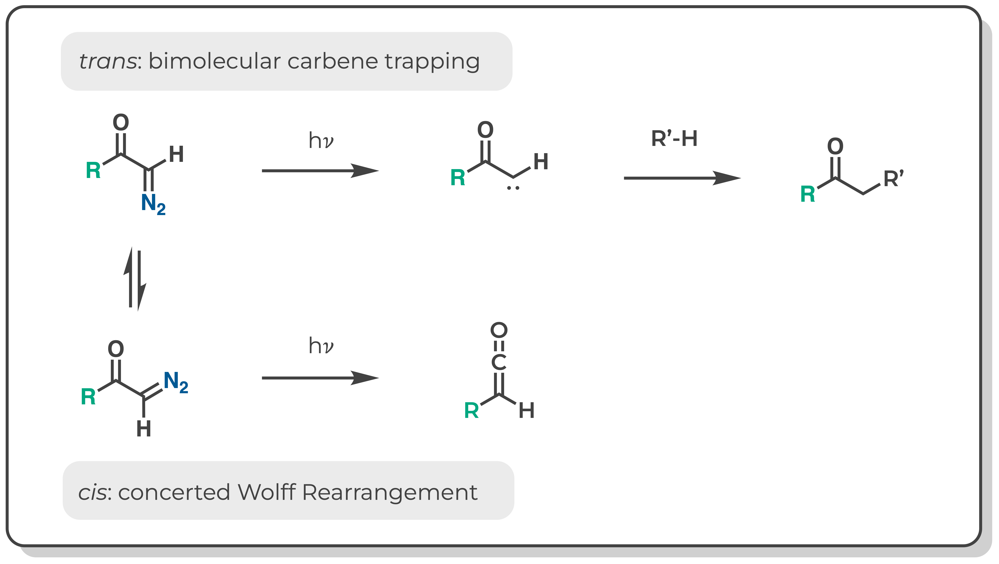

The equilibrium constants (K<sub>eq</sub>) for cis-trans isomerism of diazoacetone and methyl diazoacetate were previously measured by low temperature NMR ([*JACS* **1966**, 950–956](https://pubs.acs.org/doi/10.1021/ja00957a017)). Notably, the ketone is predominantly  cis whereas the ester is a nearly equal mixture of cis and trans. If we did not have these experimental results, could we have predicted this with DFT?
{: .text-justify }

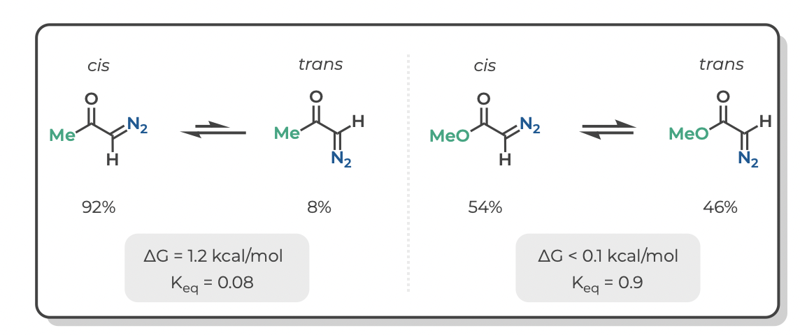

The short answer is, yes. The tables below give the experimental and computed free energies for cis-to-trans isomerism of diazoacetone and methyl diazoacetate, as well as the values of K<sub>eq</sub> at -40 &deg;C (experimental conditions) and the portion of each isomer at equilibrium. 
{: .text-justify }


Density functional theory acurately predicts that the cis isomer is preferred for the ketone (diazoacetone) whereas isomerism is approximately thermoneutral for the ester (methyl diazoacetate).
{: .text-justify }


|    molecule          | source | &Delta;G | K<sub>eq</sub> | % cis | % trans |
|:--------------------:|:------:|:---------:|:-------------:|:-----:|:-------:|
|  diazoacetone        | exp.   | 1.2       | 0.08          | 92%   | 8%      |
|  diazoacetone        | DFT    | 0.7       | 0.22          | 82%   | 18%     |
|  methyl diazoacetate | exp.   | <0.1      | 0.9           | 54%   | 46%     |
|  methyl diazoacetate | DFT    |  0.1      | 0.8           | 56%   | 44%     |

Follow the tutorial below to see how one arrives at these numbers. (And the tutorials to follow to see the wealth of additional information that one can glean from these calculations)
{: .text-justify }


## **Generate Input Structures**

The first step in performing any calculation is generating an intial set of xyz coordinates. One of the easiest ways to do this is from the 2D builder tool in ChimeraX after installing the SEQCROW extension (see [Setup ORCA]({{site.baseurl}}/page/computation/setup.html).
{: .text-justify }


From the ChimeraX GUI, go to the dropdown menu and select Tools > Structure Editing > 2D Builder. Then draw the structure in the editor and select 'open'
{: .text-justify }


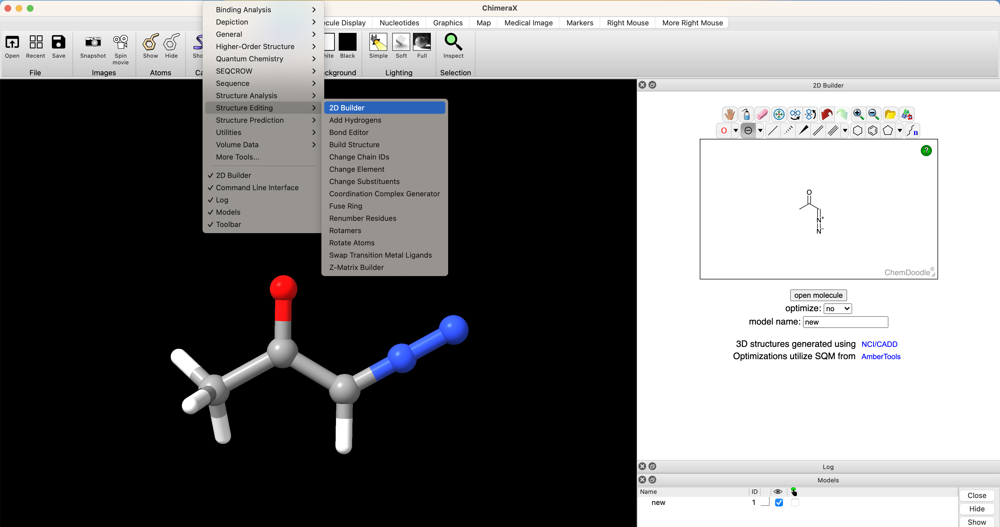

<details>

<summary>structure from SMILES</summary>

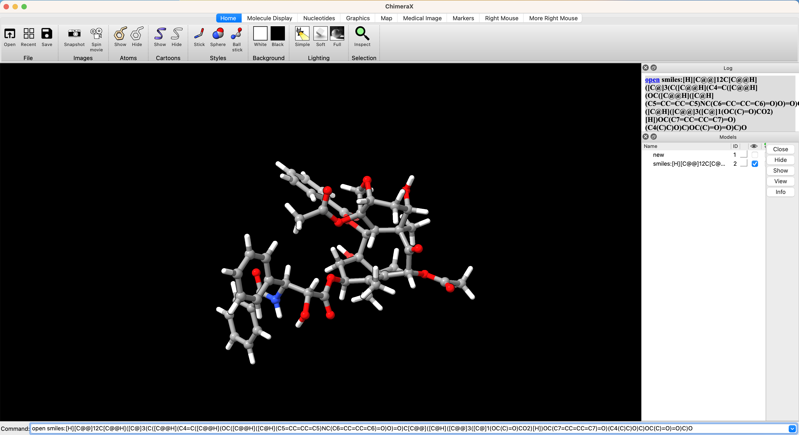

<p> One can open stuctures directly from SMILES strings. This is especially convenient if you've already drawn a complicated molecule in ChemDraw. For example, if you had already drawn Taxol in ChemDraw, you could select the structure and navigate to Edit > Copy As > SMILES. Then paste the copied SMILES string into the ChimeraX prompt <p>

Try running <code>open smiles:[H][C@@]12C[C@@H]([C@]3(C([C@@H](C4=C([C@@H](OC([C@@H]([C@H](C5=CC=CC=C5)NC(C6=CC=CC=C6)=O)O)=O)C[C@@]([C@H]([C@@]3([C@]1(OC(C)=O)CO2)[H])OC(C7=CC=CC=C7)=O)(C4(C)C)O)C)OC(C)=O)=O)C)O</code> 

</details>


## **Submit Geometry Optimization from a GUI**

Now that we have rough geometry, we need to optimize the geometry of the molecule. We can setup and submit this calculation directly from the ChimeraX+SEQCROW GUI if we have installed and setup ORCA [to-do link instructions for ORCA setup]() To do so navigate in the ChimeraX dropdown window to Tools > Quantum Chemistry > Build QM Input
{: .text-justify }


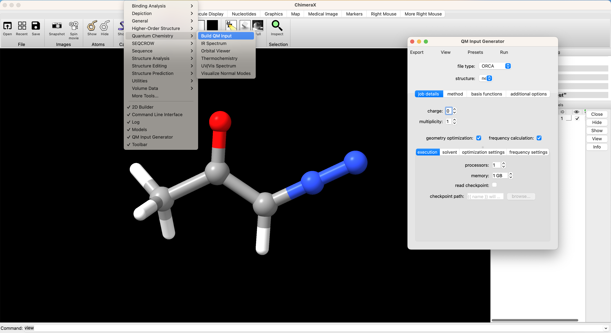

In the screenshot above you can see the first page of the QM input interface. We've selected ORCA as the file type. If multiple structures are open in ChimeraX, you can choose which structure to use as input from the 'structure' dropdown menu. Our stucture from the 2D builder is selected by it's default name 'new'. There are several sub-menus that are relevant to setting up our job. The setup for this calculation is illustrated graphically and described in more detail below.
{: .text-justify }


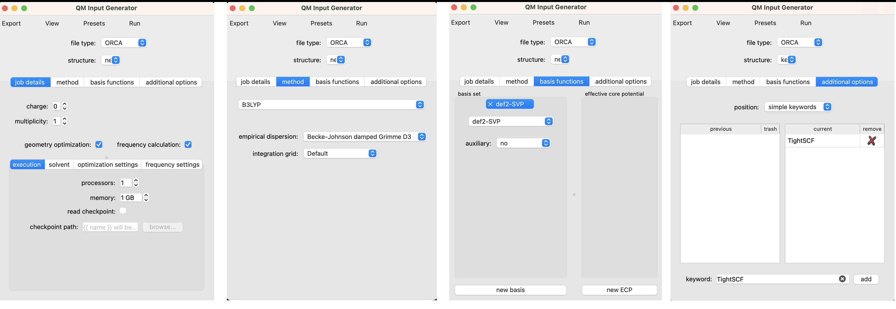

**Job Details**

The charge is 0 for our neutral molecule. The multiplicity is 1 because we are looking at the singlet state. We've selected the boxes for geometry optimization and frequency calculation. We include the frequency calculation to ensure that the geometry that results from our optimization is a true local minimum (no negative frequencies). For local calculations 1 processor and 1 GB of memory is adequate. We can also select the 'solvent' sub-menu to set an implicit solvation model. I've opted for the conductor-like polarizable continuum model (CPCM) with dichloromethane (CH2Cl2). No changes are needed in the optimization settings or frequency settings for this job.
{: .text-justify }


**Method**

For simplicity, we'll opt for the most generic method in DFT, B3LYP with Grimme's damped dispersion correction.  Neither the most efficient nor the most accurate method, but totally fine for our purposes.
{: .text-justify }


**Basis Functions**

Here we'll opt for a balanced, modern basis set, def2-svp.

**Additional Options**

It is often helpful to use tight SCF convergence criteria when performing a frequency calculation in order to mininimize numerical noise that can lead to spurious imaginary frequencies. To do so, type 'TightSCF' in the 'keyword' box and click 'add'.
{: .text-justify }


----------------------------------------------------------------

<!-- Tab links -->
<div class="tab card">
  <button class="tablinks tab-1-1" onclick="openTabId(event, 'ketone_cis.inp', 'tab-1-1')">{{ site.data.icons.codefile }}  <code>ketone_cis.inp</code></button>
</div>
<div id="ketone_cis.inp" class="tabcontent tab-1-1" style="font-size:10px">

! b3lyp d3bj def2-svp Freq Opt tightscf cpcm(CH2Cl2)
%pal
    nprocs 1
end
%MaxCore 1000
%freq
    Temp    298.15
end

*xyz 0 1
C    -0.242400  -0.772000   0.003000
H    -0.105500  -1.843300   0.002800
C     0.864100   0.070300   0.000700
N    -1.395400  -0.289200   0.000300
N    -2.432100   0.144900  -0.002200
C     2.254200  -0.511800  -0.002200
O     0.710000   1.276700   0.001000
H     2.587100  -0.652200  -1.030600
H     2.934100   0.168800   0.510200
H     2.246600  -1.473000   0.511600
*


</div>

----------------------------------------------------------------


<details>
  <summary>Optional: input stucture.</summary>
  
  <p>If you only want to run simple calculations on your local machine, you can ignore this section. If you want to start learning how to run more powerful simulations, it is worth previewing the input file in the QM Input Generator by navigating to View > Preview. </p>

  <p>Lines starting with <code>#</code> are comments and have no impact on the calculation.</p>

  <p>The line starting with <code>!</code> is the header and contains most of the essential information for this job. The order of keywords in the header is not important.</p>

  <p>The sections starting with <code>%</code> and ending with <code>end</code> are blocks. These are important for controlling more specific calculations, but we can essentially ignore them for now.</p>

</details>


**Run**

To run the job, select 'Run' in the 'QM Input Generator' and select 'on this computer' in the following dropdown menu. A new window will popup called 'Launch Job'. Give the job a name in 'job name' and select 'run'.

This optimization took about 9 minutes on my computer. The output of the optimization will popup in ChimeraX when it is finished.

The output file is located in the `SEQCROW_SCRATCH` directory that was specified when setting up SEQCROW in ChimeraX.

# **Analyze Optimized Geometry**

When the optimization is finished, it will popup in ChimeraX. 

In the screenshot below, I've hidden the input structure `new` and only have `ketone_c01` displayed (checked box under the eye icon on bottom right). 

To change the display settings to match those shown here, use the dropdown menu in ChimeraX and navigate to Presets > Ball-Stick-Endcap (only available if you have installed SEQCROW). 

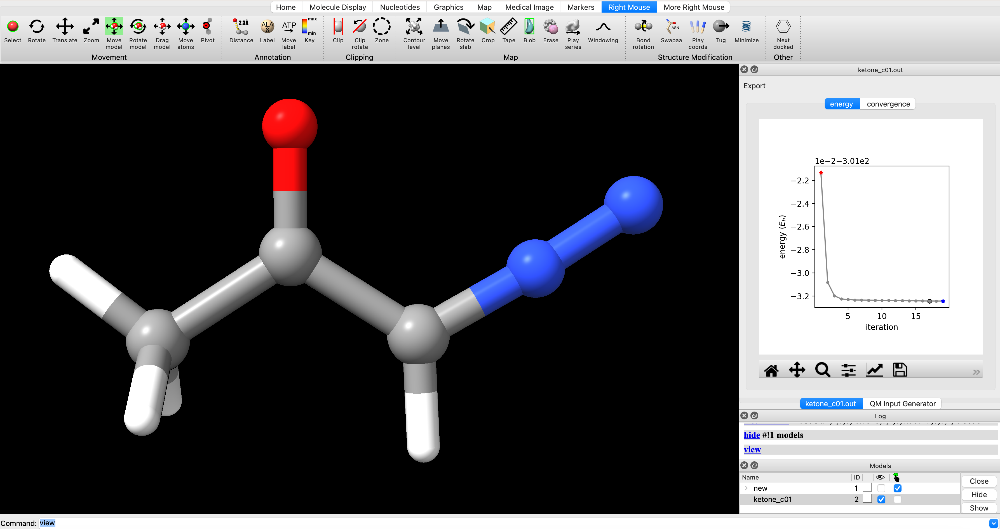

To view the optimization progress you can manually select the points in the plot of energy vs iteration as illustrated in the screengrab below.

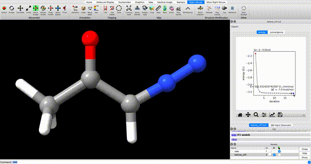

<details>

<summary>alternate optimization video</summary>

Alternately, enter `coordset slider #2` (where `#2` corresponds to the ID# in the bottom right) in the ChimeraX commandline to open a tool for playing the optimization as a video.

</details>

In the log you will see a note that reads `ketone_c01.out has 0 imaginary harmonic vibrational modes`. This confirms that the structure is a local minimum.

To manually inspect vibrational modes, navigate in the ChimeraX dropdown menu to Tools > Quantum Chemistry > Visualize Normal Modes. In the resulting popup you can display the vectors of the vibrational mode and animate it. If you animate the vibrational mode, use the Reset Coordinates button in the Visualize Normal Modes popup to ensure that you are displaying the equilibrium geometry.


#


<details>

<summary>optimization tip</summary>

If you do encounter undesired negative vibrational frequencies, one way to resolve them is to restart the optimization after displacing the geometry along the offending mode. To do so, use the Coordinate Set slider that pops up when you animate the vibration. Use the slider to displace the geometry along the offending mode, then use the displaced geomtery as a starting point for further optimization.

</details>

# **Submit Optimized Geomtery to Single Point**

Now we seek to resubmit the optimized geometry to a single point calculation at a higher level of theory. To do so, navigate to Tools > Quantum Chemistry > Build QM Input. 

Use the structure dropdown menu to select the geometry from the optimization job. Unselect the options for 'geometry optimization' and 'frequency calculation'. We will use the same solvent settings as we did in the optimization step. We will use the same method (density functional and dispersion model) as the optimization. We will use a larger basis set, def2-TZVP. Submit the job the same way the optimization was submitted (I like to use the suffix `_sp` on single point calculations to keep track of which single-point job corresponds to which geometry). 

<details>

<summary>to visualize molecular orbitals</summary>

In order to visualize molecular orbitals in a later tutorial, an additional keyword and block is needed. Add the keyword 'printBasis' as we did for 'TightSCF' above.  Under the 'additional options', use 'position' dropdown to select 'blocks'. Under 'block' enter 'scf', under 'option' enter 'print[p_mos] 1', and click 'add' for both. 

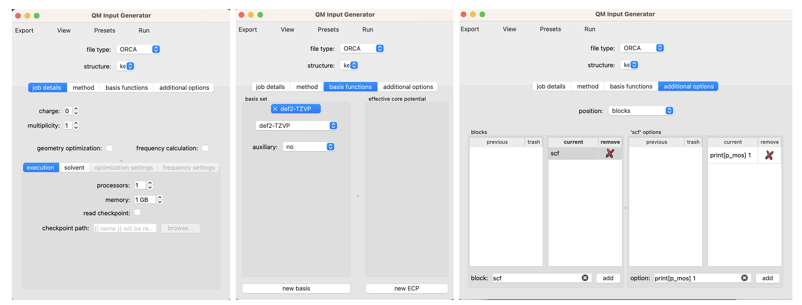

</details>


# **Rotate Torsions**

At this point we've optimized the cis geometry for alpha-diazoacetone and performed a single-point calculation. Now we need to repeat this process on the trans conformer. To generate inital coordinate for the the trans conformer, select 'Right Mouse' in the ChimeraX GUI, then select 'Bond Rotation'. Right click and drag about the bond torsion that you seek to manipulate. You can now generate a QM input for geometry optimization and frequency calculation using the the same settings that we used for the cis isomer.

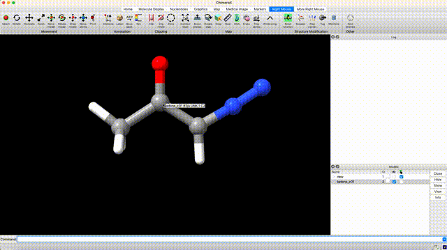

# **Analyze Thermochemistry**

After performing a geometry optimization, frequency calculation, and single-point calculation on the cis and trans conformers of diazoacetone we are ready to analyze the thermochemistry of the conformational equilibrium.

Thermochemical analysis can be performed the ChimeraX+SEQCROW GUI. First, open the optimization and single point jobs for each of the structures you wish to compare. In this case,
```
ketone_cis.out
ketone_cis_sp.out
ketone_trans.out
ketone_trans_sp.out
```

 From the dropdown menu navigate to Tools > Quantum Chemistry > Thermochemistry. In the Thermochemistry window, select the 'relative' tab. Select the following files in the designated dropdown menus.

**group 1 energy**: ketone_cis_sp.out

**group 1 frequencies**: ketone_cis.out

**group 2 energy**: ketone_trans_sp.out

**group 2 frequencies**: ketone_trans.out

The bottom of the thermochemistry window gives the energy of the 'other group' relative to the 'reference group'. 


<details>

<summary>free energy details</summary>

Since low-frequency normal modes are both prone to error and poorly modeled as vibrations, free energies are often corrected with the quasi-harmonic model of Truhlar (&Delta;G<sub>Quasi-Harmonic</sub>) or the quasi-rigid rotor harmonic oscillator model of Grimme (&Delta;G<sub>Quasi-RRHO</sub>). There is an argument to be made for each of the models and a range of cut-off frequencies (&omega;<sub>0</sub>).

</details>

For simplicity, we will use the free energy value that corresponds to the value that ORCA prints as the final free energy (&Delta;G<sub>Quasi-RRHO</sub> with &omega;<sub>0</sub> = 100 cm<sup>-1</sup>).

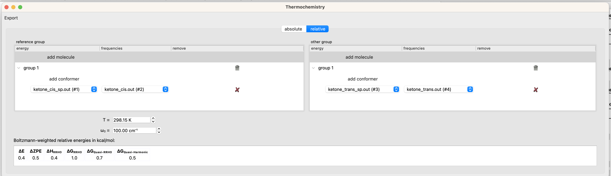

To recap, the figure and tables below summarize the measured and computed thermodynamics of cis-trans isomerism in diazoacetone and methyl diazoacetate. DFT recapitulates the observation that diazoacetone is predominantly the cis isomer at equilibrium whereas methyl diazoacetate is an nearly equal mixture of cis and trans.


|    molecule          | source | &Delta;G | K<sub>eq</sub> | % cis | % trans |
|:--------------------:|:------:|:---------:|:-------------:|:-----:|:-------:|
|  diazoacetone        | exp.   | 1.2       | 0.08          | 92%   | 8%      |
|  diazoacetone        | DFT    | 0.7       | 0.22          | 82%   | 18%     |
|  methyl diazoacetate | exp.   | <0.1      | 0.9           | 54%   | 46%     |
|  methyl diazoacetate | DFT    |  0.1      | 0.8           | 56%   | 44%     |

-------------------------------------------------------------------------

All of the input and output files for the calculations in this tutorial can be found [here](https://github.com/joegair/gair-group-docs/tree/main/assets/data/computation/code-free-dft/).. 