# {{page.title}}
{: .no_toc }

This tutorial will demonstrate how to predict IR spectra using density functional theory.

All of the input, output, and analysis files for the calculations in this tutorial can be found [here](https://github.com/joegair/gair-group-docs/tree/main/assets/data/computation/diazo-ir/). . The files are provided so that so that you can play around with visualization and analysis before running your own calculations.
{: .fs-6 .fw-300 .text-jusify}

## Table of contents
{: .no_toc .text-delta }

1. TOC
{:toc}

-----

# **What are these peaks?**

The IR spectrum of ethyl diazoacetate in cyclohexane looks like it has two distinct peaks for the N=N, C=O, and C-O stretches ([*JACS* **2022**, 9330-9343](https://pubs.acs.org/doi/10.1021/jacs.2c01208)). 
{: .text-justify }

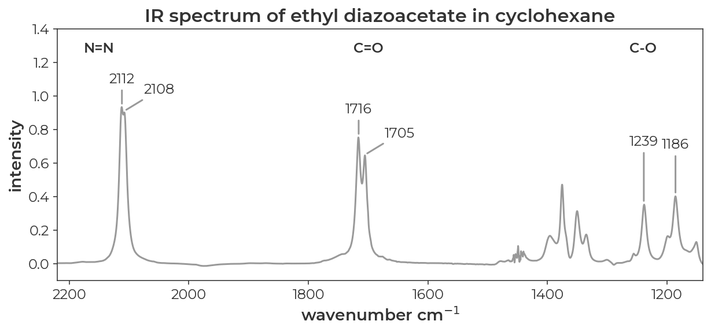

Data from SI of [*JACS* **2022**, 9330-9343](https://pubs.acs.org/doi/10.1021/jacs.2c01208)

We saw in the first tutorial that methyl diazoacetate is a nearly equal mixture of syn and anti conformers. If we assume that these pairs of peaks correspond to the syn and anti conformers, could we use DFT to assign which peak corresponds to which conformer?
{: .text-justify }

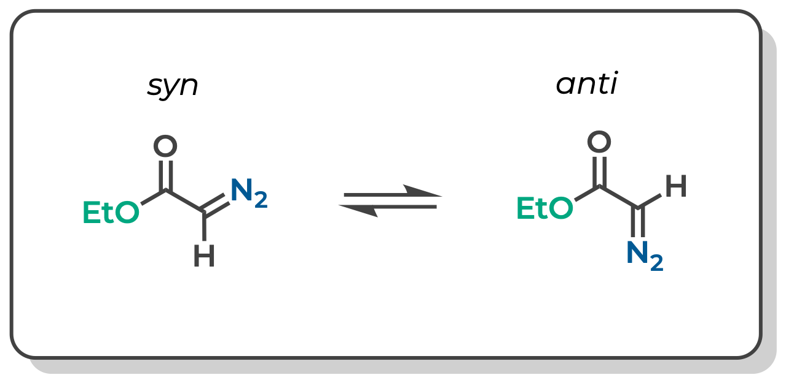

# **Substitute Substituents in ChimeraX**

We already have an optimized structure of methyl diazoacetate from the first tutorial (output [here](./files/mda_syn_sp.out)). We can open this structure in ChimeraX and modify the methyl substituent to generate an initial guess for the input geometry of ethyl diazoacetate. Tools > structure editing > change substituent. In the windown for 'substituent name:' add 'Me'. In the GUI window, select 'More Right Mouse' and 'Substitute'. Then right click on one of the hydrogens on the methyl group of methyl diazoacetate to substitute the H for Me. The added substituent is shown in space filling mode to give a sense for potential clashes.
{: .text-justify }

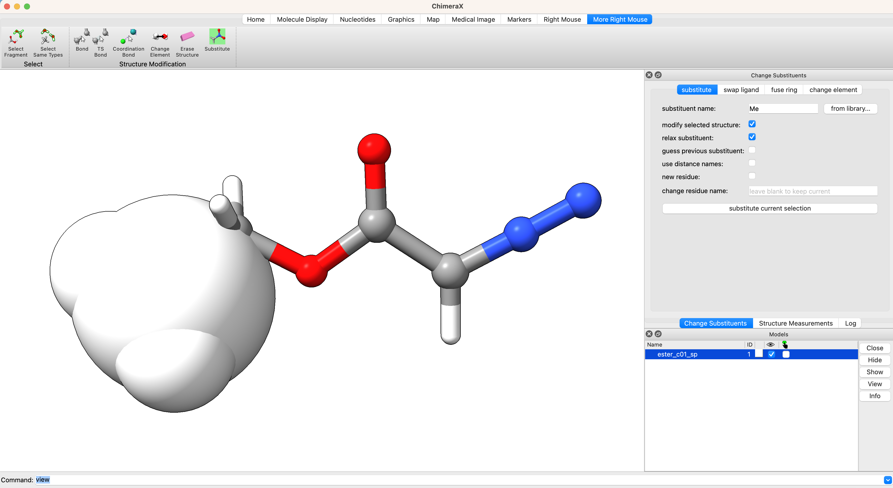

Follow the same procedure to generate the input structure of the anti isomer.

# **Generate Input File and Run Calculation**

With the updated geometry, we will generate and submit the job in the same way we did in the first tutorial. The only significant change to the method is that we will use cyclohexane for the implicit solvent model and we will use 6-31G* as the basis set because vibrational scaling factors are readily available for B3LYP 6-31G*.
{: .text-justify }

----------------------------------------------------------------

<!-- Tab links -->

  <button class="tablinks tab-1-1" onclick="openTabId(event, 'eda_syn.inp', 'tab-1-1')">{{ site.data.icons.codefile }}  <code>eda_syn.inp</code></button>


! B3LYP tightscf Freq Opt 6-31G* CPCM(CycloHexane)
%pal
    nprocs 1
end
%MaxCore 1000
%freq
    Temp    298.15
end

*xyz 0 1
C     0.917852  -0.637477  -0.212483
C    -0.307682   0.128522  -0.016164
N     2.049677   0.016640  -0.238808
O    -1.373434  -0.692560  -0.012876
O    -0.375873   1.334518   0.125684
C    -2.649232  -0.071566   0.170809
N     3.020133   0.598093  -0.258681
H     0.960640  -1.719095  -0.339346
H    -2.698332   0.437846   1.145350
H    -2.844281   0.663409  -0.624848
C    -3.674601  -1.192126   0.112821
H    -3.650137  -1.676924  -0.886065
H    -4.692047  -0.784480   0.291735
H    -3.448628  -1.953203   0.889415
*



----------------------------------------------------------------

We can submit this job from the ChimeraX GUI in the same way we did in the first tutorial. The optimization and frequency calculation took just under 8 minutes on my computer. Perform the same geometry optimization and frequency calculation for the anti isomer.
{: .text-justify }

# **Visualize Vibrational Modes**

Once the optimization is complete, we can visualize the normal modes of interest from the dropdown menu Tools > Quantum Chemistry > Visualize Normal Modes.
{: .text-justify }

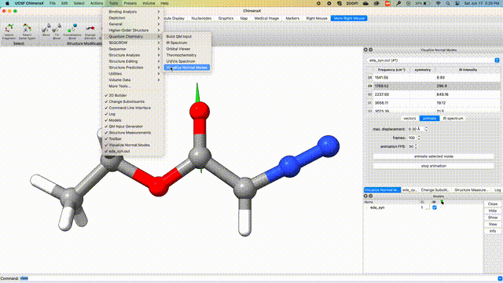

# **Visualize IR Spectrum**

From a computational output file containing a frequency calculation, one can visualize a modeled IR spectrum in ChimeraX+SEQCROW. Tools > Quantum Chemistry > IR spectrum The spectrum can be scaled in the frequency scaling tab. Here we use B3LYP/6-31G(d) as the method and basis set. The scaled computed spectrum of the syn conformer of ethyl diazoacetate is shown below.
{: .text-justify }

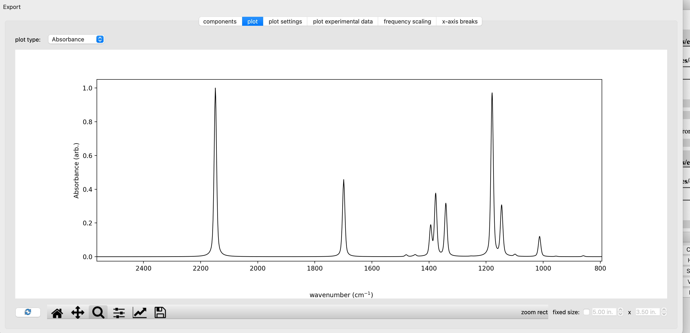

We can overlay the calculated and experimental spectrum in the 'plot experimental data' tab. A CSV of the experimental spectrum reported in [*JACS* **2022**, 9330-9343](https://pubs.acs.org/doi/10.1021/jacs.2c01208) can be found [here](./files/EDA_FTIR_Neat_CyH.csv). Be sure to set 'skip first lines:' to '1' to account for the fact that the first line includes column titles rather than data. The overlaid spectrum is shown below with the experimental spectrum in grey and the computed spectrum for syn-EDA in black.
{: .text-justify }

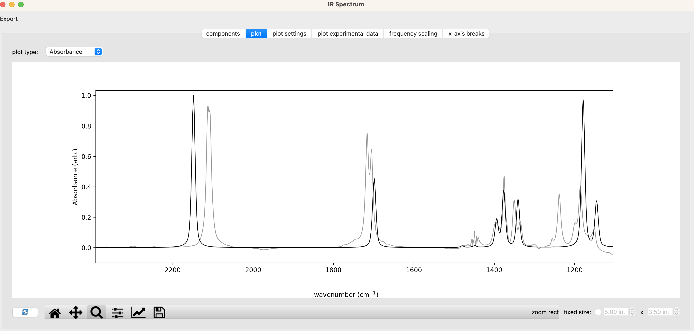

We can then compare the IR spectra of the syn and anti conformers to the experimental spectrum by opening the [output](./files/eda_anti.out) of anti-EDA in ChimeraX. In the IR Spectrum window, select the components tab and select 'add conformer'. Set the new conformer to eda_anti.out for both the frequency file and energy file.
{: .text-justify }

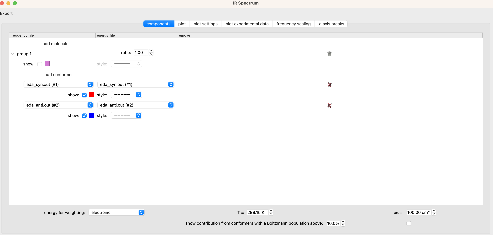

The resulting spectrum is plotted below with the experimental spectrum in grey, the computed syn spectrum in red, the computed anti spectrum in, and the sum of the two computed spectra in black. I've used the 'x-axis breaks' tab to zoom in on the regions of interest. These data can be exported to a [CSV](files/EDA_from_aaron.csv) file with the 'export' button in the upper left corner of the 'IR spectrum window'. The resulting CSV can be used for plotting in excel or a JupyterNotebook.
{: .text-justify }

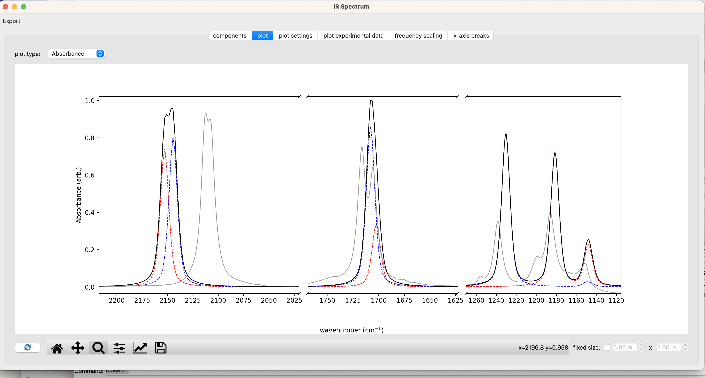

Below, I've replotted the data in a JupyterNotebook which can be found [here](./files/diazoIR.ipynb). The overall message is that DFT does a good job of recapitulating the absolute stretching frequencies of both isomers and predicts differences in the spectra of the syn and anti isomers that line up nicely with the pairs of peaks observed in the experimental spectrum.
{: .text-justify }

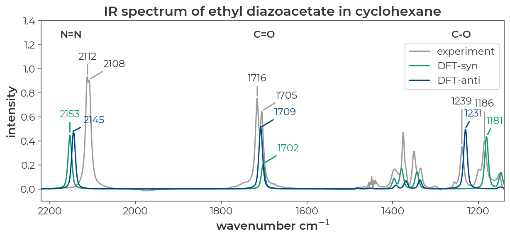

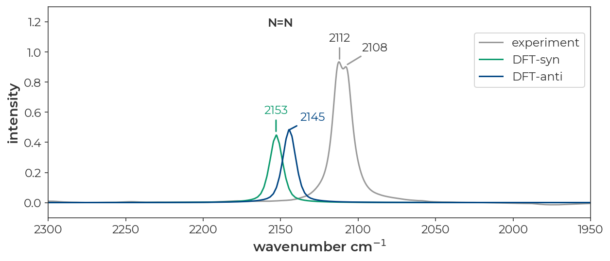

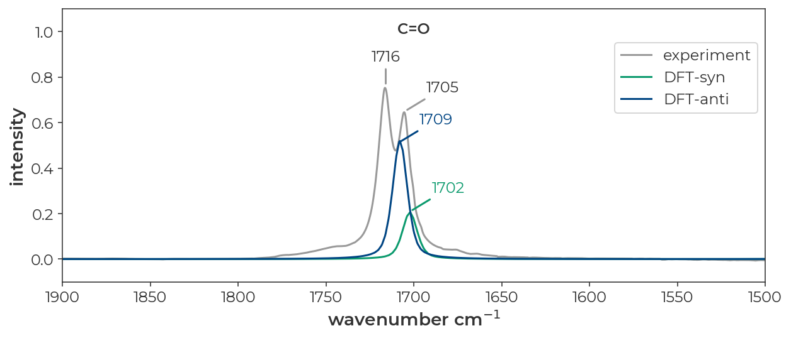

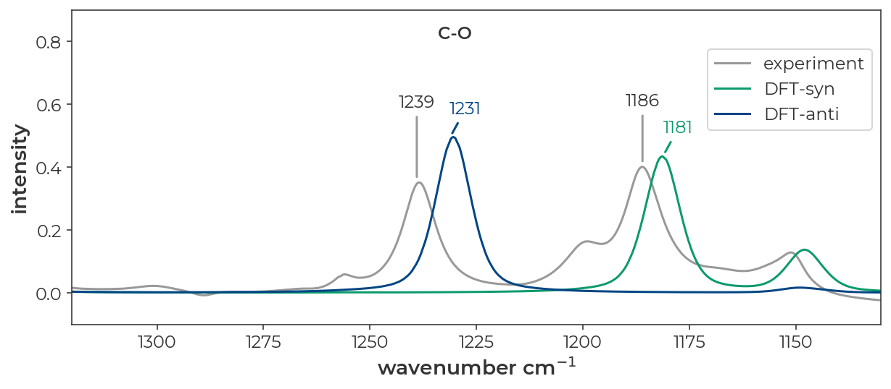

